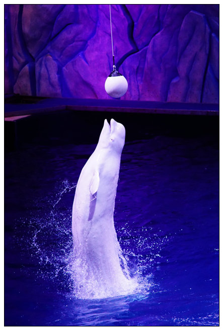
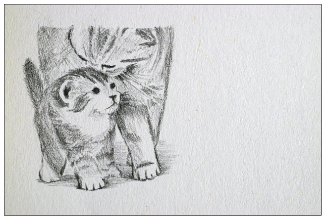
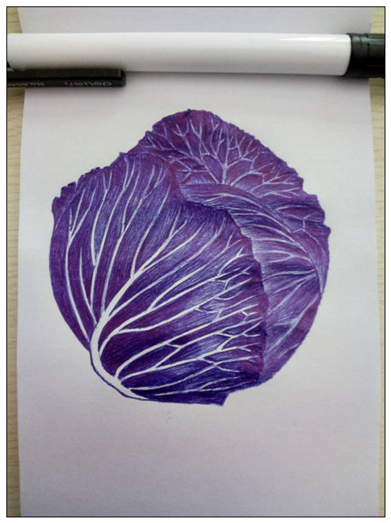
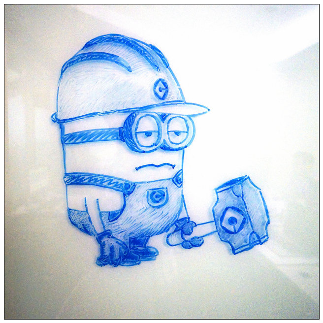
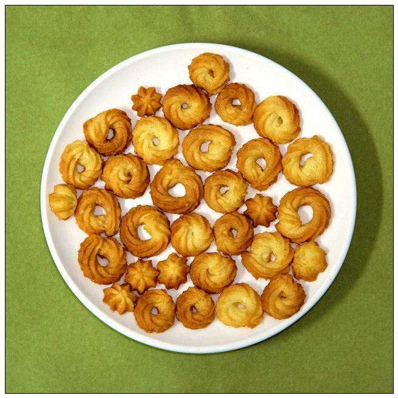
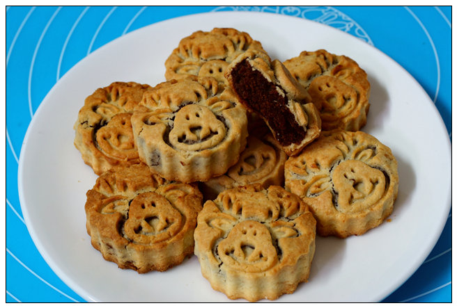

网名neutra，全栈开发，知识面广，却不够深。

## 更新

之前的网站源码丢失了，硬盘坏掉无法读取，平时真要养成备份个人资料的习惯。

翻了遍之前的文章，发现数量不多，重新改回Markdown也花不了太多时间，于是抽空整理了一番，用了最新版hexo，换了个对移动端更友善的主题，慢慢再调整样式了。

博客园那里的还有一些旧文章，都懒得再复制了，先这么放着吧。 接下来还是得抽空写写，顺便放点照片啥的到这里。

## 过往

2001年开始从VB开始接触，写些小程序。 高中开始自学C，参加ACM比赛，无奈没什么出彩的成绩。 

大学选了光信息专业，有时会跟计算机学院的老师做些.Net的项目，大三选计算机为双学位，无奈“与原专业太接相似”只能当辅修，于是作罢。 

毕业后在做通信网优的公司专注于某个数据分析软件开发3年，巩固了C#软件开发的各个方面，因为不想眼界受限，辞职离开了第一家公司。

后来从事过C++/Erlang的页游后端，某大公司的网站后端，并开始接触前端页面、微信公众号、安卓应用等开发。

2015年下半年，初中一起编程的同学找到了我，希望能合伙创业，前期打算先做手游赚点钱把公司养活，而我负责游戏客户端开发。

于是我离开了广州在深圳开始创业，花了一个月适应C++/Lua/cocos2dx的游戏开发，然后花两个月开发了一款麻将游戏，再花了一个月对接第三方游戏账号和支付平台。 那段时间，每天早上9点工作到晚上10点多，一切都在匆忙地进行着。 

当我们规划第二款手游时，出现了游戏风格、玩法和市场定位的问题，经过各处咨询，最后得出个沮丧的结论：即使这款手游能如期完成，也没有平台愿意推广，市场太残酷。 用户的获得很大程度依赖于推广，但高额的推广成本是小公司难以承受的。 创造足够新颖的玩法、快速实现并推出市场试错，才是小游戏公司的生存方式。

**“小公司能养活自己已经是很高的目标了”**——这是我听到最无奈的话。

没多久公司就宣布解散了，我也回到广州，目前在某电商做创新项目的开发。

近几年接触的领域太广，本以为可以静下心来往深度发展，可惜项目要被砍了，项目组的同事各散东西，我也快失业了，公司内部转岗的话，有些比较无趣的岗位，可能对个人发展不利。 如果离开，那简历就更难看了，没多少人会留意你为何离开，大多数人关注的只是，你近一年换了两次工作……

## 爱好

- 摄影

- 绘画

- 烘焙

